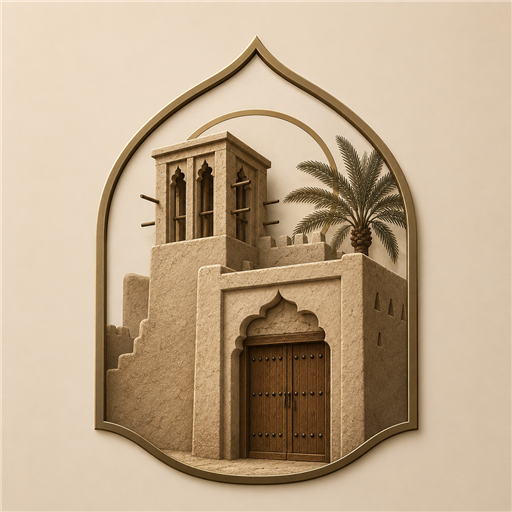

<p align="center"></p>

# عقاري ديزاين

منصة SaaS للوسطاء العقاريين لتصميم منشورات إنستقرام للعقارات (فلل، شقق، أراضٍ…) بخط ثمانية — بدون أي أدوات تصميم.

## المزايا
- 4 قوالب جاهزة: عصري، فاخر، نظيف، بطاقة
- 3 مقاسات: مربع 1080×1080، عمودي 1080×1350، ستوري 1080×1920
- رفع صورة العقار مع تكبير وتحريك، ورفع شعار المكتب
- بيانات كاملة: الحالة، النوع، العنوان، الموقع، السعر، المواصفات، بيانات الوسيط
- ألوان قابلة للتخصيص + خط ثمانية (Sans للنصوص وSerif Display للأسعار)
- تصدير PNG / JPG بدقة كاملة
- حسابات وحفظ سحابي للتصاميم عبر Supabase

## التشغيل
افتح `index.html` في المتصفح مباشرة — لا يحتاج سيرفر ولا تثبيت.

## تفعيل الحفظ السحابي (Supabase)
1. أنشئ مشروعاً مجانياً في [supabase.com](https://supabase.com)
2. من **SQL Editor** الصق محتوى ملف [`supabase-setup.sql`](supabase-setup.sql) واضغط **Run**
3. من **Settings → API** انسخ:
   - **Project URL**
   - **anon public key**
4. افتح `index.html` وابحث عن هذين السطرين واستبدل القيمتين:
   ```js
   const SUPABASE_URL = 'ضع_رابط_المشروع_هنا';
   const SUPABASE_ANON_KEY = 'ضع_مفتاح_anon_هنا';
   ```
5. أعد فتح الصفحة — سيظهر قسم «حسابي وتصاميمي» جاهزاً للتسجيل والحفظ

> مفتاح anon مصمم للاستخدام العلني في المتصفح، والأمان مضبوط بسياسات RLS في قاعدة البيانات: كل وسيط يرى تصاميمه فقط.

## الخط
خط ثمانية (Thmanyah Typeface) — ملفات woff2 في مجلد `fonts/` مع ملف الترخيص.
